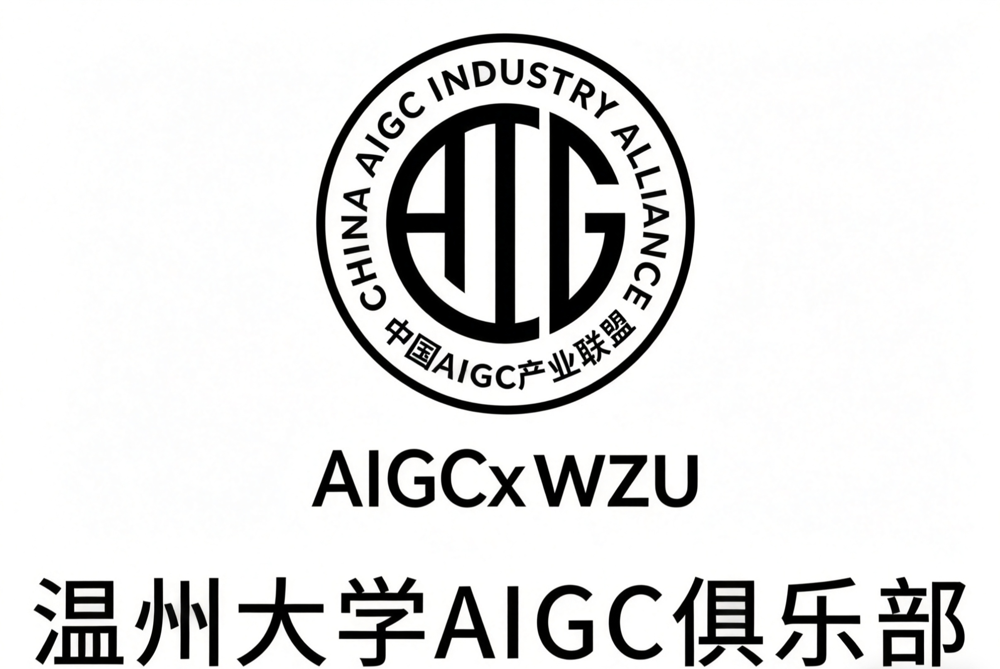

  

# Yueon Labs · AIGC-WZU

## 温州大学 AIGC 俱乐部 / Lab 型 AI 实践社群

**以 Lab 方式做真实项目；AIGC 是支持能力，不是我们的边界。**

---

## 👋 About us

**Yueon Labs / AIGC-WZU** 是由 **温州大学 AIGC 俱乐部** 发起和建设的 GitHub 组织。

我们不是只做「AI 生成图片 / 视频 / 文案」的兴趣群，而是一个更偏 **Lab 性质** 的学生实践社群：围绕 AI 系统、个人智能体、自动化工具、AI + 教育、AI + 创意生产力等方向，持续做项目、写文档、沉淀开源成果。

**AIGC 对我们来说不是边界，而是基础能力与支持层。** 生成式 AI 是我们的工具箱，用来帮助成员更快地学习、设计、开发、表达和验证想法；真正的目标是把想法做成可以运行、可以展示、可以复用的项目。

## 🧪 Lab positioning

我们的定位：

> **A student-led AI lab community at Wenzhou University, supported by AIGC and driven by real projects.**

更具体地说，我们希望把俱乐部建设成：

- **项目实验室**：用真实项目推动学习，而不是只停留在讨论和工具体验；
- **技术孵化器**：从 prompt、workflow、agent 到可运行的应用系统；
- **创作工作台**：用 AI 支持图像、视频、PPT、数字人、交互媒体和内容生产；
- **开源资料库**：把学习路径、工具测评、实践案例和 workshop 材料沉淀下来；
- **协作社群**：连接技术、设计、教育、传媒、商业和文化方向的同学。

## 🚀 What we build

- **AI Agents / Personal Assistants** — 个人智能体、长期记忆助手、任务规划与执行系统。
- **AI Workflows** — 自动化流程、工具调用、知识库、信息检索、内容生产流水线。
- **Creative AI Tools** — 图像、视频、PPT、数字人、交互媒体与创意辅助工具。
- **AI + Education** — 学习助手、课程创新、教学资源生成、人机协作学习方式。
- **Open-source Resources** — 教程、项目模板、工具清单、实践案例、Workshop 材料。

## 📦 Active projects

- [NetAgent-CLI / PrivateClaw](https://github.com/Yueon-Labs/NetAgent-CLI)  
  A local AI assistant with persistent memory, deep search, controlled command execution, scheduled tasks, and Feishu message ingress.

## 🛠️ Repositories we are preparing

- `awesome-aigc` — AIGC / AI tools, tutorials, papers, cases, and learning resources.
- `yueon-labs.github.io` — Lab website, project showcase, event archive, and member portfolio.
- `ai-demos` — small AI applications and prototypes built by members.
- `workshop-materials` — slides, notebooks, prompts, and hands-on guides.

## 🤝 Who we welcome

欢迎温州大学对 AI、技术、设计、内容创作、教育创新、产品实践感兴趣的同学加入。

你不一定需要一开始就会写代码。我们更看重：

1. 愿意主动学习；
2. 愿意把想法做出来；
3. 愿意记录和分享；
4. 愿意参与长期项目建设。

可以参与的方向包括：

| Direction | You can do |
| --- | --- |
| 技术开发 | AI 应用、Agent、网页 Demo、自动化脚本、数据处理 |
| 内容资料 | 工具测评、教程整理、论文/案例阅读、知识库维护 |
| 视觉创意 | AI 绘图、视频生成、海报、PPT、品牌视觉、作品集 |
| 产品运营 | 活动策划、社群运营、公众号/小红书/B站内容、项目展示 |
| 比赛项目 | 创新创业、挑战杯、互联网+、AIGC 创作赛、AI 应用赛 |

## 🌱 Principles

- **Project-driven** — 用项目推动学习，而不是只停留在讨论。
- **Human-centered** — AI 服务于人的创造力、学习能力和解决问题能力。
- **Interdisciplinary** — 技术、设计、教育、传媒、商业和文化可以一起做项目。
- **Open sharing** — 能公开的知识尽量文档化，能复用的成果尽量开源化。
- **Responsible use** — 保持独立思考，尊重原创、署名、隐私和合理边界。

## 🔗 Links

- GitHub Organization: <https://github.com/Yueon-Labs>
- Wenzhou University: <https://www.wzu.edu.cn/>
- WZU news: [AI 可以这样玩！大学生用人工智能生成温州古城](https://www.wzu.edu.cn/info/1321/91587.htm)

---

**Yueon Labs · AIGC-WZU**  
温州大学 AIGC 俱乐部 · Lab 型 AI 实践社群

